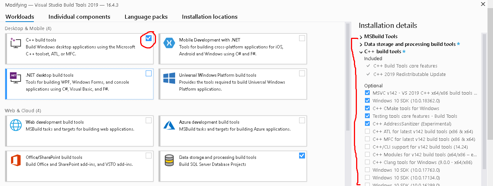

# HOW TO INSTALL FAST-TEXT ON WINDOWS

[Since it uses C++11 features, it requires a compiler with good C++11 support.](https://stackoverflow.com/questions/64261546/how-to-solve-error-microsoft-visual-c-14-0-or-greater-is-required-when-inst)
1. Download and install [vs_BuildTools.exe](https://visualstudio.microsoft.com/visual-cpp-build-tools/)

2. Restart

3. Look at your python version:
	> 
		python --version
	output: <em>Python 3.10.4</em>

4. Download precompiled [fasttext](https://www.lfd.uci.edu/~gohlke/pythonlibs/#fasttext) known that for:

	> fastText 0.9.2 Python 3.11 wheel for Windows x64

	> 
		pip install fasttext‑0.9.2‑cp311‑cp311‑win_amd64.whl

	Therefore you have to download the wheel based on your python version and os
	> 
		fasttext‑{VERSION}‑cp{PYTHON_VERSION}‑cp{PYTHON_VERSION}‑win_amd{OS_VERSION}.whl

5. After the installation you can go [here](https://fasttext.cc/docs/en/language-identification.html) and download the [lid.176.bin](https://dl.fbaipublicfiles.com/fasttext/supervised-models/lid.176.bin) model.

-----

## IF THERE ARE ANY ISSUES:

MAYBE YOU NEED THOSE REQUIREMENTS, BUT TAKE CARE THAT THEY ARE FOR LINUX ENV, SO...
[You will need Python (version 2.7 or ≥ 3.4), NumPy & SciPy and pybind11](https://github.com/facebookresearch/fastText/tree/master/python)

>
	pip install Cython==0.29.32
	pip install scipy==1.9.3 # (check if install numpy, otherwise: pip install numpy==1.23.5)
	pip install pybind11==2.10.1

